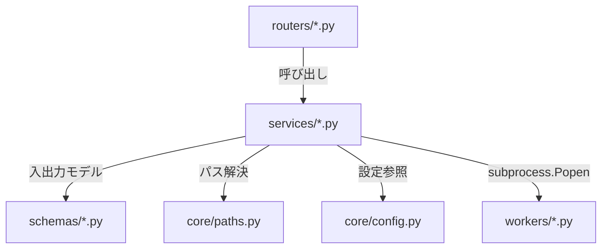
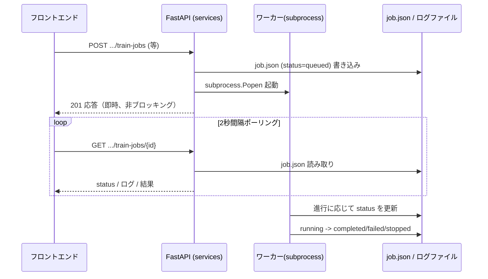

# アーキテクチャ

既存の `docs/architecture.md`（設計仕様書）の内容を一次情報源とし、実ソース（`backend/app/main.py` のルーター登録順、`frontend/src/App.tsx`、`frontend/src/api/client.ts`）で裏付けを取った上で整理したものです。

## 全体構成

```mermaid
flowchart LR
    Browser["ブラウザ<br/>React SPA (:5173)"]
    Vite["Vite dev proxy<br/>/api/* → :8000"]
    FastAPI["FastAPI (:8000)<br/>routers → services → schemas/core"]
    Worker["workers/*.py<br/>別プロセス（subprocess.Popen）<br/>Ultralytics / OpenCV"]
    Data["projects/&lt;name&gt;/ 配下のファイル<br/>画像・ラベル・data.yaml・runs・predictions 等"]

    Browser -->|fetch(JSON)| Vite --> FastAPI
    FastAPI -->|subprocess.Popen| Worker
    Worker -->|job.json / ログを read-modify-write| Data
    FastAPI -->|ファイルI/O| Data
    Browser -.->|MJPEG stream| FastAPI
```

（出典: `docs/architecture.md` 1章、`frontend/vite.config.ts`）

## レイヤ構造（バックエンド）

`docs/architecture.md` 2章、および `backend/app/` の実ディレクトリ構成より。

| 層 | 位置 | 役割 |
|---|---|---|
| routers | `backend/app/routers/` | HTTP エンドポイント。入力検証と例外→HTTP ステータス変換のみ |
| services | `backend/app/services/` | ドメインロジック本体（ファイル入出力・集計・ジョブ起動） |
| schemas | `backend/app/schemas/` | Pydantic の入出力モデル |
| core | `backend/app/core/` | `config.py`（設定）、`paths.py`（プロジェクト配下のパス解決とパストラバーサル防止） |
| workers | `backend/workers/` | `app` に依存しない独立スクリプト。絶対パス引数のみで動く |

**例外方針**（`docs/architecture.md`）: services は `XxxValidationError`(400) / `XxxNotFoundError`(404) / `XxxConflictError`(409) を投げ、routers が対応する HTTP ステータスへ変換する。



## モジュール関係（ルーター一覧）

`backend/app/main.py` で `include_router` される実働ルーター（登録順、21個）。

`projects, images, capture, annotations, label_validation, datasets, training, evaluation, prediction, analysis, experiments, model_registry, model_export, onnx_export, augmentation, preprocess, selection, reports, video, sam`

加えて `backend/app/routers/stubs.py` による未実装工程用スタブルーター群を登録するループがあるが、`_STUB_FEATURES` リストは空（コメント: 「全工程が実ルーターへ移行済み。スタブは無し」）。

## ワーカー方式（学習・推論・ONNX・映像・撮影）

`docs/architecture.md` 3章より。

- services が `job.json`（status=`queued`）を書き、`subprocess.Popen` でワーカーを起動、標準出力/エラーをログファイルへリダイレクトする。
- ワーカーは処理の進行に応じて `job.json` の `status` を `running`→`completed`/`failed`/`stopped` に更新する。
- フロントは 2 秒間隔でポーリングして状態・ログ・結果を取得する（完了/失敗で停止）。
- ドライラン用環境変数（`YTS_TRAIN_DRY_RUN` 等、詳細は [`08_CONFIGURATION.md`](08_CONFIGURATION.md)）でテストや依存未導入時の疎通確認ができる。
- 同名ジョブの上書き保護（train/video/capture 共通）: 既存ジョブディレクトリへの上書きは、`status` が `queued`/`running` であるか、記録済み PID が生存していれば「実行中」とみなして拒否する。削除は一旦ゴミ箱名へ rename してから行う安全削除方式。
- `job.json` の排他制御（映像推論・撮影）: 設定 PATCH・停止・ワーカー自身の状態更新が同じ `job.json` を read-modify-write するため、`job.json.lock`（排他生成方式のファイルロック）で直列化している。



## データフロー（案件データのレイアウト）

`docs/architecture.md` 4章より。案件データのルートは `YTS_PROJECTS_ROOT`（未指定時 `<repo>/projects`）。

```text
projects/<name>/
├── project.yaml              # 概要・task(detect|segment)・created_at
├── classes.yaml              # classes: [{id, name, color}]（id は 0 始まり・追加順）
├── raw/images/               # 取り込んだ元画像（原則非破壊）
├── processed/                # 前処理出力（images / thumbnails / metadata.json / preview）
├── annotations/labels/       # YOLO 形式ラベル（*.txt, utf-8-sig で読む）
├── selection/selection.json  # 画像選別の結果（included/excluded/review）
├── datasets/<dataset>/       # train/val/test 分割コピー + data.yaml + metadata.json
├── runs/train/<job_id>/      # 学習ラン（job.json, train.log, weights/best.pt|last.pt, results.csv 等）
├── predictions/<id>/         # 推論（job.json, results.json, outputs/, preprocessed_inputs/）
├── video/<id>/               # 映像推論（job.json, live/latest.jpg, stop.flag）
├── video/known_sources.json  # 映像取得に成功したURLの記憶（プロジェクト単位、認証情報を含み得る）
├── capture/sources.json      # 撮影ソース（カメラ/URLの定義）の永続化
├── capture/<session_id>/     # 撮影セッション（job.json, live/latest.jpg, stop.flag）
├── exports/onnx/<id>/        # ONNX エクスポート（model.onnx, metadata.json）
├── exports/packages/<id>/    # 配布パッケージ（zip）
├── reports/                  # レポート（JSON / Markdown）
├── sam/settings.json         # SAM 補助アノテーション設定
└── models/selected_model.json# 採用モデル（参照パスのみ保存。コピーしない）
```

`core/paths.py` が全パスを解決し、ファイル名指定は resolve 後に親ディレクトリ内かを検証してパストラバーサルを防止する（`is_valid_project_name()` 等、`backend/app/core/paths.py`）。

## API構成

エンドポイント全量は [`06_API_REFERENCE.md`](06_API_REFERENCE.md) を参照。ベース URL は `http://localhost:8000`、全エンドポイントは `/api` 配下（`docs/api-reference.md`）。認証はなし（ローカル単一ユーザー前提）。

## 状態管理（フロントエンド）

- `frontend/package.json` の `dependencies`/`devDependencies` に Redux / Zustand / Recoil / MobX 等の外部状態管理ライブラリは存在しない（確認済み・grep 0件）。
- 各ページ（`frontend/src/pages/*.tsx`）が React の `useState`/`useEffect` でローカルに状態を保持し、`api/client.ts` 経由でバックエンドとやり取りする構成（`frontend/src/pages/SelectionPage.tsx`, `AnnotatePage.tsx` 等で確認）。
- 一部の UI 状態（Sidebar 折り畳み `yts_steps_collapsed`、Annotate タスク一覧折り畳み `yts_annotate_tasklist_collapsed`、Selection 表示サイズ `yts_selection_thumb_size` 等）はブラウザの `localStorage` に保存し、ページ再読込後も復元する（`frontend/src/components/ProjectLayout.tsx`, `frontend/src/pages/AnnotatePage.tsx`, `frontend/src/pages/SelectionPage.tsx`）。
- グローバルな状態管理コンテキスト（React Context によるアプリ全体状態等）は `frontend/src/App.tsx` に確認できない（ルーティングのみ）。

## 通信方法

- フロントエンド→バックエンドは `frontend/src/api/client.ts` に集約された `fetch()` 呼び出し（`BASE = "/api"`、相対パス）。開発時は Vite dev proxy が `/api` を `http://localhost:8000` へ転送する（`frontend/vite.config.ts`）。
- レスポンス形式は JSON。エラーは `400`/`404`/`409` を `{"detail": "..."}` で返す（`docs/api-reference.md`）。
- 映像推論・撮影のライブプレビューは `multipart/x-mixed-replace`（MJPEG）ストリーミングで配信する（`backend/app/routers/video.py`, `backend/app/routers/capture.py` の `/stream` エンドポイント）。
- CORS は `backend/app/core/config.py` の `cors_origins`（`http://localhost:5173`, `http://127.0.0.1:5173`）のみ許可。
